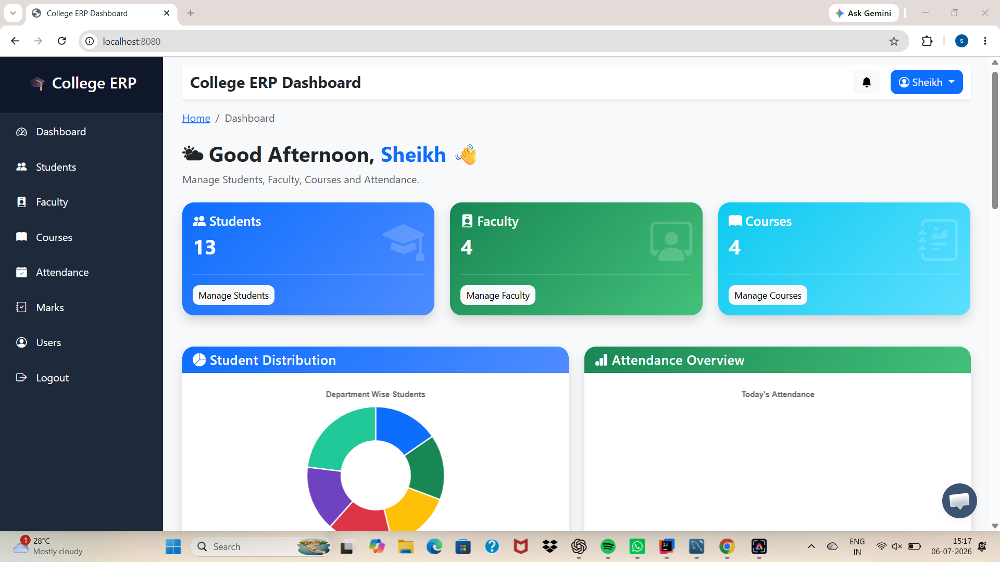
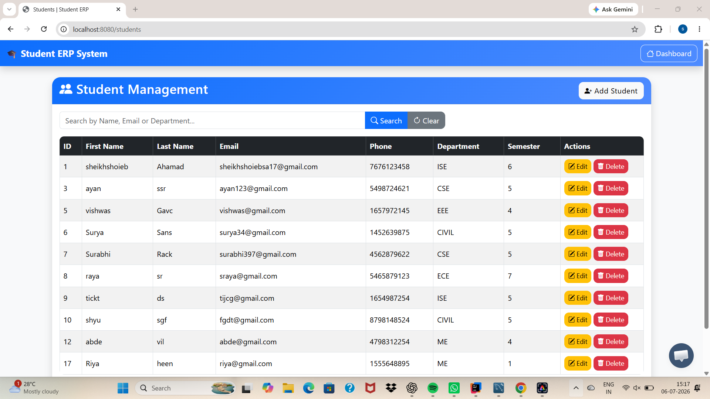
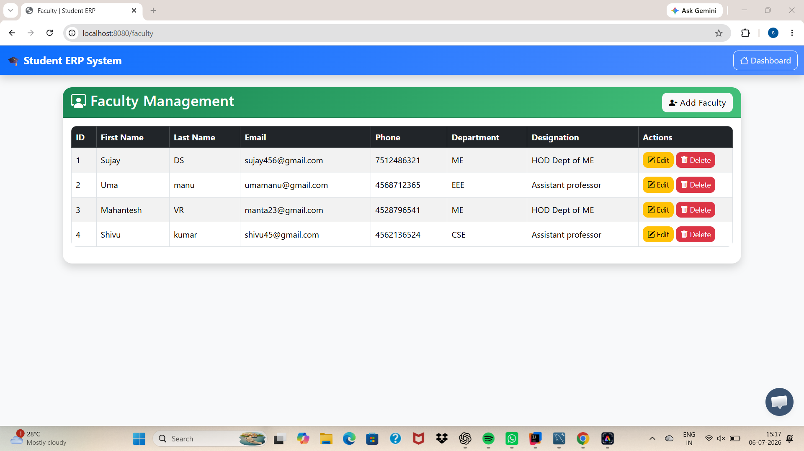
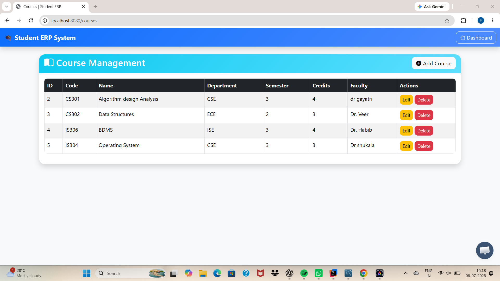
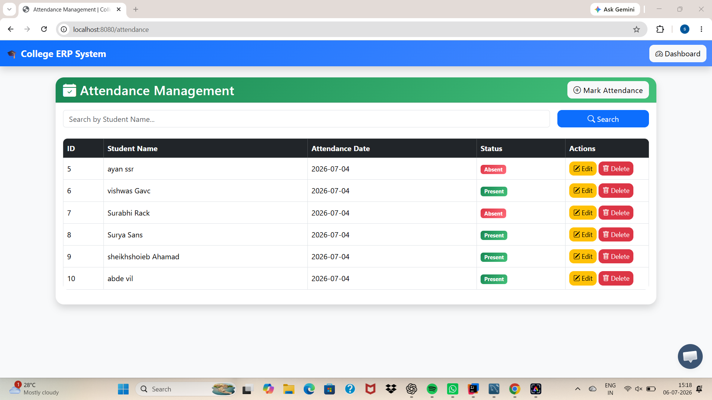
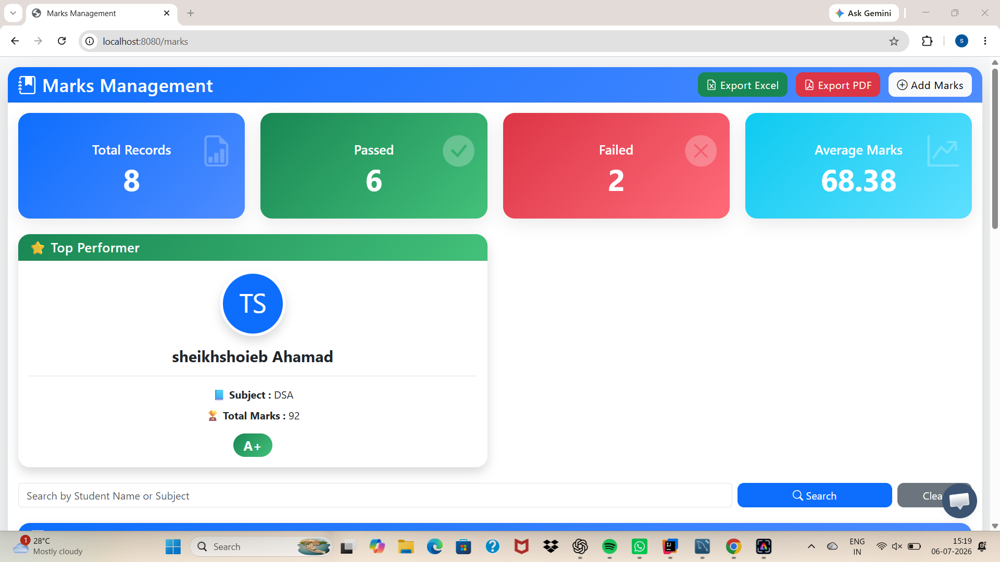
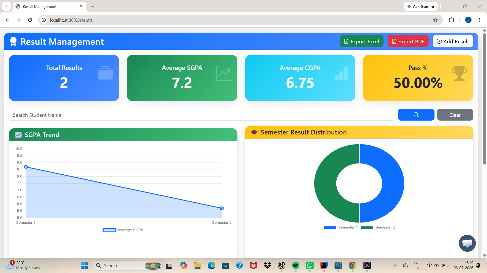
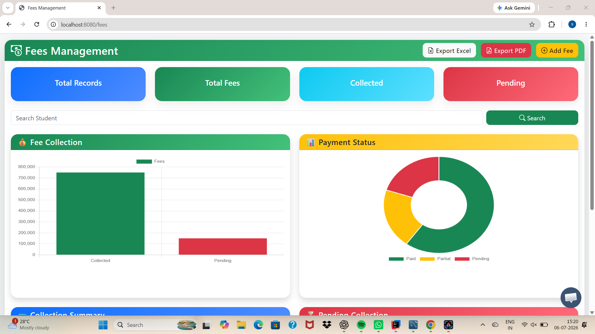
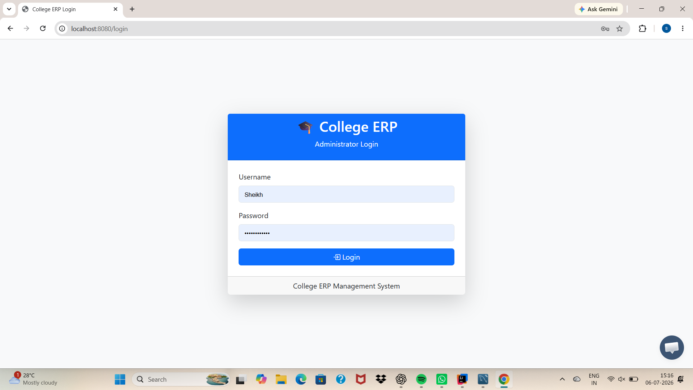

# 🎓 College ERP Management System

<p align="center">
  
  
  
  
  
  
  
  
</p>

---

## 📌 Overview

The **College ERP Management System** is an enterprise-grade, full-stack web application designed to digitize and streamline institutional workflows for colleges and universities. Built with modern **Spring Boot 3.5**, **Spring Security 6**, **Spring Data JPA**, **MySQL**, and **Thymeleaf**, the system delivers an end-to-end platform for administering academic operations, student registries, faculty details, course curriculum, daily attendance, examination grading, fee tracking, and automated document generation.

Equipped with role-based access control, interactive analytics, RESTful APIs, and OpenAPI/Swagger documentation, it ensures both robust administrative control and an intuitive user experience.

---

## 📑 Table of Contents

- [✨ Key Features](#-key-features)
- [📸 Screenshots & UI Tour](#-screenshots--ui-tour)
- [🏛 System Architecture](#-system-architecture)
- [🛠 Tech Stack](#-tech-stack)
- [📁 Project Structure](#-project-structure)
- [⚙️ Prerequisites & Installation](#️-prerequisites--installation)
- [🗄️ Database Setup](#️-database-setup)
- [🔑 Default Credentials](#-default-credentials)
- [📡 RESTful APIs & Swagger](#-restful-apis--swagger)
- [📊 Reporting & Document Generation](#-reporting--document-generation)
- [🤝 Contributing](#-contributing)
- [👨‍💻 Author & Acknowledgments](#-author--acknowledgments)
- [📄 License](#-license)

---

## ✨ Key Features

| Module | Features & Capabilities |
| :--- | :--- |
| 📊 **Interactive Dashboard** | Real-time counts of students, faculty, and courses; daily attendance percentage tracker; department-wise student distribution; and quick-view tables of recently enrolled students and faculty. |
| 👨‍🎓 **Student Management** | Full CRUD capabilities, real-time keyword search, server-side pagination, department filtering, input validation, and student directory export. |
| 👨‍🏫 **Faculty Directory** | Add and manage teaching staff profiles, department affiliations, academic designations, and direct contact information. |
| 📚 **Course Catalog** | Maintain department courses, credit distributions, semester associations, descriptions, and designated instructors. |
| 📅 **Attendance Tracker** | Daily attendance recording by date and student, real-time present/absent counters, and cumulative attendance percentage calculation. |
| 📝 **Marks & Grading** | Subject-wise internal marks and assessment recording, automated total scoring, and instant export to Excel and PDF. |
| 🏆 **Results & CGPA** | Semester result calculation, GPA/CGPA computation, status indicators (Pass/Fail), and academic record cards. |
| 💳 **Fee Management** | Track student tuition fees, payment status, receipts, and outstanding dues. |
| 🔐 **Security & RBAC** | Spring Security 6 with BCrypt password hashing, session management, CSRF protection, and role-based permissions (`ADMIN`, `FACULTY`). |
| 📑 **Report Generation** | Automated report generation powered by Apache POI (Excel `.xlsx`) and LibrePDF OpenPDF (formatted `.pdf`). |
| 🚀 **RESTful API & Swagger** | Clean REST API endpoints with Springdoc OpenAPI 3.0 / Swagger UI documentation for headless integrations. |

---

## 📸 Screenshots & UI Tour

<div align="center">

### 📊 Administrative Dashboard
*Comprehensive real-time analytics, metrics cards, department breakdown, and recent activity.*
<br/>


<br/><br/>

### 👨‍🎓 Student Management Module
*Student directory with keyword search, pagination, and actions.*
<br/>


<br/><br/>

### 👨‍🏫 Faculty Management Module
*Faculty records with designations, departments, and contact information.*
<br/>


<br/><br/>

### 📚 Course Management Module
*Course listings with course codes, departments, credits, and instructors.*
<br/>


<br/><br/>

### 📅 Attendance Tracker
*Daily student attendance records and tracking.*
<br/>


<br/><br/>

### 📝 Marks & Assessment Management
*Student exam marks entry with export to PDF & Excel.*
<br/>


<br/><br/>

### 🏆 Results & CGPA Engine
*Semester grade points, cumulative GPA, and result status overview.*
<br/>


<br/><br/>

### 💳 Fee Management Module
*Student fees status, payment history, and collection records.*
<br/>


<br/><br/>

### 🔐 Secure Login Authentication
*Clean login portal with Spring Security authentication.*
<br/>


</div>

---

## 🏛 System Architecture

The project adheres to a clean, decoupled **Layered MVC Architecture**:

```
 ┌─────────────────────────────────────────────────────────┐
 │                      Client Layer                       │
 │      (Thymeleaf Templates, Bootstrap 5, REST Clients)   │
 └────────────────────────────┬────────────────────────────┘
                              │ HTTP / JSON
 ┌────────────────────────────▼────────────────────────────┐
 │                    Controller Layer                     │
 │      Web Controllers (MVC)  &  REST Controllers (API)   │
 └────────────────────────────┬────────────────────────────┘
                              │
 ┌────────────────────────────▼────────────────────────────┐
 │                     Service Layer                       │
 │        Business Logic, Data Validation, & Exports       │
 └────────────────────────────┬────────────────────────────┘
                              │
 ┌────────────────────────────▼────────────────────────────┐
 │                    Repository Layer                     │
 │          Spring Data JPA / Hibernate ORM Entities       │
 └────────────────────────────┬────────────────────────────┘
                              │ JDBC
 ┌────────────────────────────▼────────────────────────────┐
 │                     Database Layer                      │
 │                     MySQL Database                      │
 └─────────────────────────────────────────────────────────┘
```

---

## 🛠 Tech Stack

| Domain | Technology / Library | Version |
| :--- | :--- | :--- |
| **Language** | Java (JDK) | 17+ |
| **Framework** | Spring Boot | 3.5.0 |
| **Security** | Spring Security 6 (BCrypt, Form Login) | 6.x |
| **Data & ORM** | Spring Data JPA, Hibernate | 3.5.0 |
| **Database** | MySQL Server | 8.0+ |
| **View Engine** | Thymeleaf & Thymeleaf Security Extras | 3.x |
| **UI Styling** | Bootstrap 5, FontAwesome, HTML5, CSS3 | 5.3+ |
| **PDF Reporting** | LibrePDF / OpenPDF | 1.3.39 |
| **Excel Reporting** | Apache POI (poi-ooxml) | 5.2.5 |
| **API Documentation** | Springdoc OpenAPI (Swagger UI) | 2.8.9 |
| **Build & Dependency** | Apache Maven | 3.8+ |

---

## 📁 Project Structure

```
college-erp-system/
├── database/
│   └── student_management.sql          # Pre-configured MySQL schema & sample seed data
├── screenshots/                        # Module showcase screenshots
│   ├── dashboard.png
│   ├── students.png
│   ├── faculty.png
│   ├── course.png
│   ├── attendance.png
│   ├── marks.png
│   ├── results.png
│   ├── fees.png
│   └── login.png
├── src/
│   ├── main/
│   │   ├── java/com/college/sms/
│   │   │   ├── config/                 # Security & web configuration
│   │   │   ├── controller/             # Spring MVC & REST API controllers
│   │   │   ├── dto/                    # Data Transfer Objects
│   │   │   ├── entity/                 # JPA database entities
│   │   │   ├── exception/              # Global error handlers
│   │   │   ├── export/                 # Excel & PDF generation utilities
│   │   │   ├── repository/             # Spring Data JPA repositories
│   │   │   ├── service/                # Business logic interfaces & implementations
│   │   │   ├── util/                   # Utility helpers
│   │   │   └── StudentmanagementsystemApplication.java
│   │   └── resources/
│   │       ├── application.properties  # Database & server configuration
│   │       ├── static/                 # CSS, JavaScript, and images
│   │       └── templates/              # Thymeleaf view templates by module
│   └── test/                           # Unit & integration tests
├── pom.xml                             # Maven project dependencies
└── README.md
```

---

## ⚙️ Prerequisites & Installation

### Prerequisites

Ensure you have the following installed on your machine:
- **Java Development Kit (JDK) 17** or higher (`java -version`)
- **Apache Maven 3.8+** (`mvn -v`) or use the included Maven Wrapper (`mvnw`)
- **MySQL Server 8.0+** running locally or remotely
- **Git**

---

### Step-by-Step Setup

#### 1. Clone the Repository
```bash
git clone https://github.com/sheikhshoiebsa17-droid/college-erp-system.git
cd college-erp-system
```

#### 2. Configure MySQL Database

Open your MySQL client or terminal and create the database:
```sql
CREATE DATABASE student_management;
```

Import the initial schema and sample dataset:
```bash
mysql -u root -p student_management < database/student_management.sql
```

#### 3. Update Database Configuration

Edit [`src/main/resources/application.properties`](file:///src/main/resources/application.properties) with your MySQL credentials:
```properties
spring.datasource.url=jdbc:mysql://localhost:3306/student_management?useSSL=false&serverTimezone=UTC
spring.datasource.username=root
spring.datasource.password=YOUR_MYSQL_PASSWORD
spring.datasource.driver-class-name=com.mysql.cj.jdbc.Driver

spring.jpa.hibernate.ddl-auto=update
spring.jpa.show-sql=true
spring.jpa.properties.hibernate.format_sql=true
spring.jpa.database-platform=org.hibernate.dialect.MySQLDialect

spring.thymeleaf.cache=false
server.port=8080
```

#### 4. Build and Run the Application

Using the Maven Wrapper:
```bash
# On Linux / macOS
./mvnw clean spring-boot:run

# On Windows PowerShell / Command Prompt
.\mvnw.cmd clean spring-boot:run
```

Alternatively, build the `.jar` package:
```bash
mvn clean package
java -jar target/studentmanagementsystem-1.0.0.jar
```

#### 5. Access the Web Application
Open your browser and navigate to:
```
http://localhost:8080
```

---

## 🔑 Default Credentials

| Username | Role | Description |
| :--- | :--- | :--- |
| `Sheikh` | `ADMIN` | Full administrative access to all modules and configurations |
| `admin` | `ADMIN` | Default admin credential *(configurable in DB/properties)* |

> [!TIP]
> Passwords in the database are encrypted using **BCrypt**. You can add additional users or alter credentials directly through the application or by generating a BCrypt hash for the `users` table.

---

## 📡 RESTful APIs & Swagger

The application provides RESTful endpoints for integration with mobile applications or external systems:

### Student Endpoints (`/api/students`)

| HTTP Method | Endpoint | Description | Access |
| :--- | :--- | :--- | :--- |
| `GET` | `/api/students` | Retrieve all student records | Public / Authenticated |
| `GET` | `/api/students/{id}` | Retrieve a specific student by ID | Public / Authenticated |
| `POST` | `/api/students` | Register a new student | Public / Authenticated |
| `PUT` | `/api/students/{id}` | Update existing student record | Public / Authenticated |
| `DELETE` | `/api/students/{id}` | Delete a student record | Public / Authenticated |

### 📖 Interactive Swagger OpenAPI Documentation

Once the server is running, explore and test all APIs interactively via Swagger UI:
- **Swagger UI Interface:** [http://localhost:8080/swagger-ui/index.html](http://localhost:8080/swagger-ui/index.html)
- **OpenAPI 3.0 JSON Specification:** [http://localhost:8080/v3/api-docs](http://localhost:8080/v3/api-docs)

---

## 📊 Reporting & Document Generation

The system includes built-in document exporters:
- **PDF Marks Cards & Grade Reports:** Rendered dynamically using **LibrePDF / OpenPDF** with institution headers, subject breakdowns, total aggregates, and verification footers.
- **Excel Student & Marks Rosters:** Formatted multi-column spreadsheets generated with **Apache POI** for easy offline archiving and departmental audits.

---

## 🤝 Contributing

Contributions are welcome! If you'd like to improve features, fix issues, or enhance documentation:

1. **Fork** the repository
2. **Create a feature branch:**
   ```bash
   git checkout -b feature/amazing-feature
   ```
3. **Commit your changes:**
   ```bash
   git commit -m "feat: add amazing new feature"
   ```
4. **Push to your branch:**
   ```bash
   git push origin feature/amazing-feature
   ```
5. **Open a Pull Request** with a detailed explanation of your changes.

---

## 👨‍💻 Author & Acknowledgments

**Developed by:** [Sheikh Shoieb Ahamad](https://github.com/sheikhshoiebsa17-droid)  
*Crafted with Spring Boot ❤️, Java, and Clean Architecture principles.*

---

## 📄 License

This project is licensed under the **MIT License** — feel free to use and adapt this project for educational and institutional purposes.